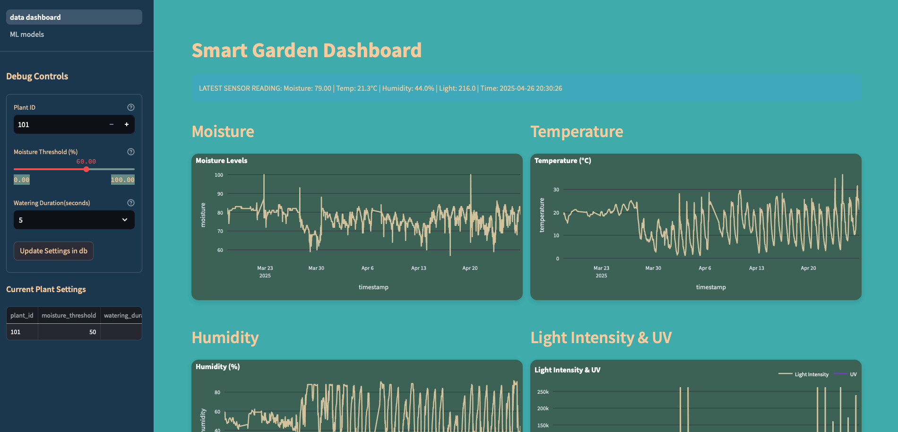
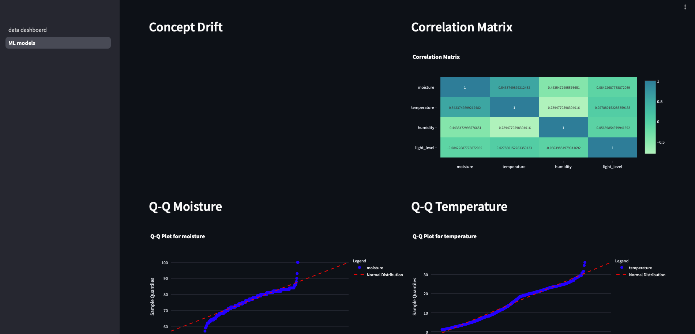

# Smart Garden IoT System
An intelligent, distributed IoT system for automated garden monitoring and management using Python, MQTT, SQLite,
and Arduino edge nodes. The system collects environmental data, automates watering and lighting, and will soon leverage machine
learning for optimized plant care.

## Technology Stack
* Backend
    * Python 3.9+
    * MQTT(Mosquitto)
    * SQLite
    * SciKit, MLFlow (planned for ML/MLOPS)

* Frontend
  * Streamlit
  * Plotly for data visualization

* Hardware
  * Raspberry Pi(Central Server)
  * Arduino Uno(Edge nodes)
  * Sensors: Soil moisture, temperature, humidity, light
  * Actuators: Relays, Water Pumps
  
## System Overview
The System is structured around three components.
1. Edge Nodes(Arduino) Distributed sensor modules that collect environmental data and control actuators.
2. Central Server (Raspberry Pi): MQTT broker that process data and makes automation decisions
3. User Interface: Interactive Streamlit dashboard for monitoring and configuration

Early prototype for the ML Service page

### Features

* Real-time Monitoring: Track soil moisture, temperature, humidity, Light levels.
* Automated Irrigation: Rule-based watering system.
* Plant Profiles: Customizable settings for different plant types(tropical, desert, herbs)
* Data Collection & Visualization: Comprehensive data storage and interactive dashboard
* Machine Learning Integration: infrastructure for ML-powered automation(in development)

### Technical Implementation

Communication Protocol(MQTT)

The System uses MQTT(Message Queuing Telemetry Transport) as its communication backbone:

* Topics Structure
  * python garden/+/sensors: Sensor readings from plants(wildcard for plant_id)
  * garden/{plant_id}/conrol: Control commands sent to edge nodes
* JSON - payloads contain sensor readings and control commands

### Database Architecture
Uses SQLite database to store sensor readings, and watering events:
1. **db_handler.py**: Core for sensor readings and plant settings
   * **sensor_data**: Time-series environmental readings
   * **plant_settings**: Indiviudal plant configuration
   * **default_plant_settings**: Templates for different plant types(Generic)
2. **ml_db_handler.py**: Machine Learning database manager for training data collection
   * **watering_events**: Complete record of watering runs with moisture diff
   * **watering_feedback**: User adjustments to the ml automated decisions
   * **watering_predictions**: ML model predictions
### Automation Logic
The **plant_controller.py** implements a multi-stage decision process: 
1. **Rule-based Decisions**: Simple threshold comparisons
   * if moisture < threshold --> activate water pump with set duration
2. **ML-enhanced Decisions**: (future implementation)
    * Predictive watering based on historical patterns 
    * Optimization of watering duration based on measured effectiveness
### User Interface
The streamlit dashboard proves: 
* Real-time sensor visualization with interactive charts
* Historical data trends for all environmental readings
* Plant settings management interface
* Debug control for system testing

### Future Development
* Machine Learning Integration: Implementing predictive models(currently prototyping with RandomForest, XGBoost)
* Mobile App: working on iOS app for easier monitoring. Plans of including CORE ML and use vision model for plant species recognition
* Solar Power Integration: Making edge nodes energy independent

